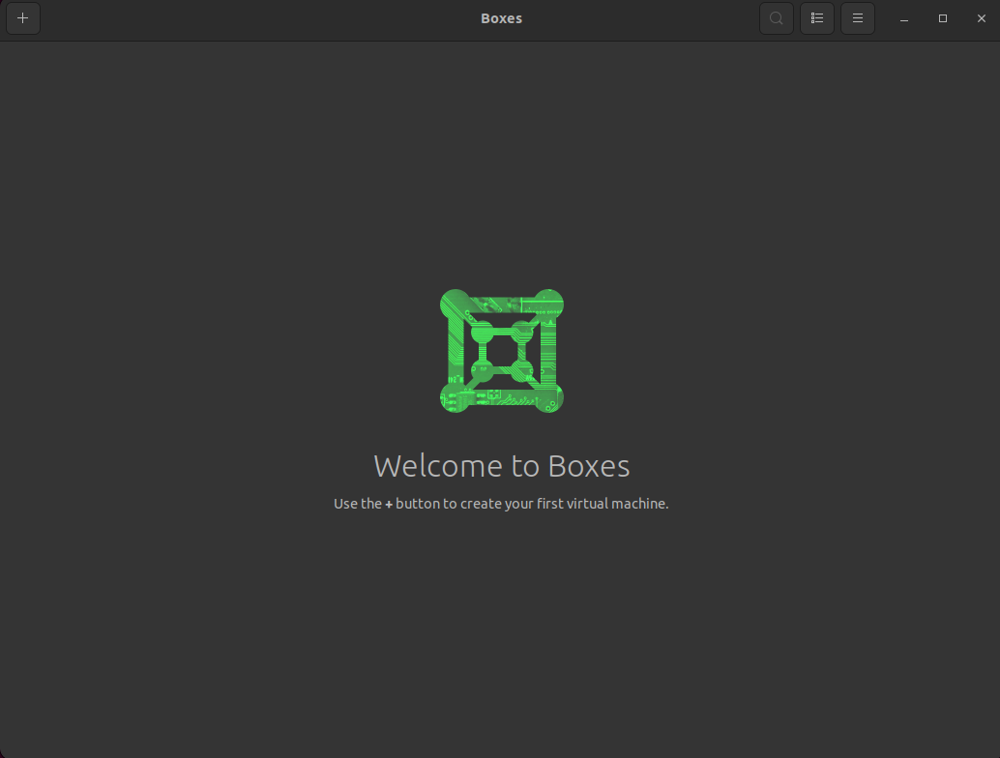
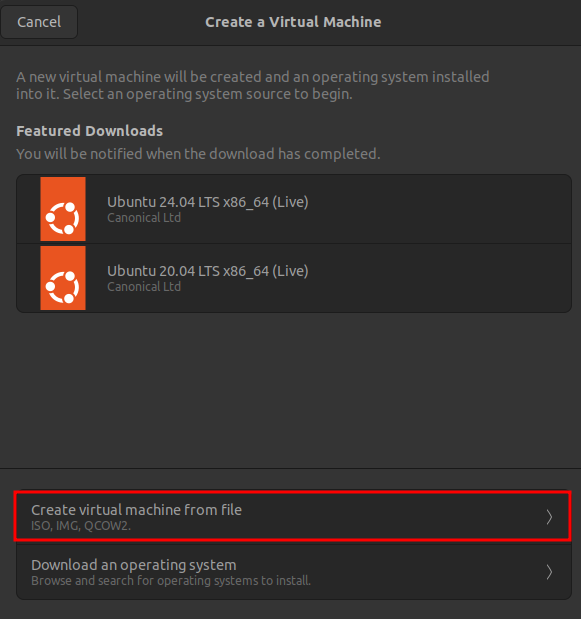
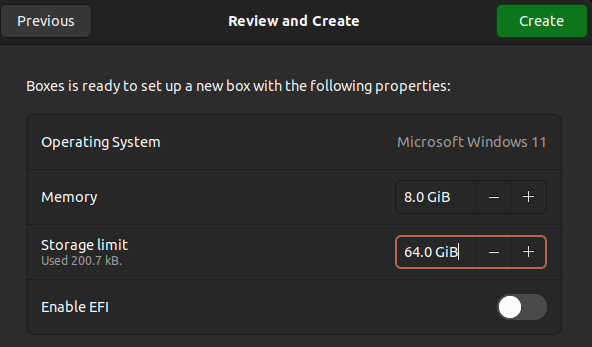
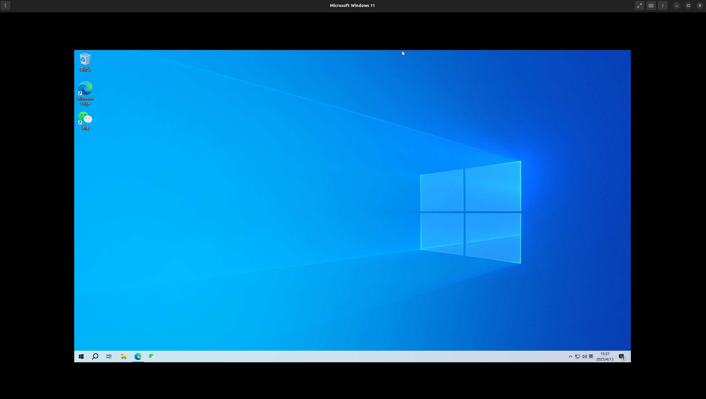

# 在Ubuntu系统中安装Windows子系统


## References

[1][在Ubuntu系统中用虚拟机安装Win10](https://zhuanlan.zhihu.com/p/625253859)

---

以 Ubuntu 作为日常工作的主系统时，还是避免不了有 Windows 系统的需求。
虽然大多数人会选择在 Windows 上使用 WSL/WSL2/虚拟机，但是这种方式可能没法满足需要 Linux 物理机的人群需求。

基于长时间以 Linux 作为办公主系统的使用经历，整理汇总此经验贴。

## 1. 虚拟机和Windows子系统安装

### 1.1 在 Ubuntu中安装 gnome-boxes 虚拟机

（这个虚拟机从23年使用至今，确实很好用）。

安装前可以先 search 一下，确保库里有
```shell
apt search gnome-boxes
```
随后应该会显示类似以下内容
```shell
Sorting... Done
Full Text Search... Done
gnome-boxes/jammy-updates xx.x-0ubuntu1 amd64
  Simple GNOME app to access virtual systems

```
然后可以直接安装
```shell
sudo apt install gnome-boxes -y
```

### 1.2 下载 Windows 系统的 ISO 文件

Windows 10 下载：[https://www.microsoft.com/zh-cn/software-download/windows10ISO](https://www.microsoft.com/zh-cn/software-download/windows10ISO)
Windows 11 下载：[https://www.microsoft.com/zh-cn/software-download/windows11](https://www.microsoft.com/zh-cn/software-download/windows11) （**测试了，目前 gnome-boxes 对这里下载的 Win11 还不支持**）

### 1.3 创建子系统

打开下载安装好 gnome-boxes，界面如下：


点击左上角的加号，选择从文件创建虚拟机：


然后选择第2步中下载好的 Windows 系统。

随后按照需求设置分配给子系统的RAW和存储空间。
>其中 Enable EFI 可以不勾选，这个是用来提升系统安装兼容性、支持更好的启动管理和安全功能的，虚拟机中安装时可以不用。



之后点击"Create"，开始正常的 Windows 系统安装。


## 2. 配置

Windows安装结束后，在虚拟机中会发现界面不会自适应虚拟机窗口尺寸，如下图，也不能在 Linux 和 Windows 之间共享剪切板以及文件，所以还需要进行以下配置。


### 2.1 共享剪切板和画面自适应配置

在安装的 Windows 子系统中安装下面两个软件：
1. `virtio-win-gt-x64.msi`
Fedora官方Archive：[https://fedorapeople.org/groups/virt/virtio-win/direct-downloads/archive-virtio/](https://fedorapeople.org/groups/virt/virtio-win/direct-downloads/archive-virtio/)
下载较新版本文件夹中的 `virtio-win-gt-x64.msi`

> 软件简介：virtio-win-gt-x64 是一个用于 Windows 虚拟机的驱动程序包，主要用于在虚拟化环境中提升性能和兼容性，包括（1）提供高性能的网络和存储驱动，旨在优化虚拟机与主机之间的通信；（2）通过 VirtIO 技术，减少虚拟机的 IO 开销，从而提升整体性能；(3)适用于使用 KVM/QEMU 等虚拟化技术的环境，确保 Windows 虚拟机能够顺利运行。
在安装 Windows 虚拟机时，通常需要加载这些驱动程序，以便 Windows 能够识别和使用虚拟硬件。

2. `spice-guest-tools-latest.exe`
官方Archive：[https://www.spice-space.org/download/windows/spice-guest-tools/](https://www.spice-space.org/download/windows/spice-guest-tools/)
下载latest版（最后更新时间是2018-01-04）。
`softwares/`文件夹下放有下载好的文件。

> 软件简介：spice-guest-tools-latest 是一组用于增强虚拟机性能和用户体验的工具，主要用于在使用 SPICE 协议的虚拟化环境中运行的操作系统（如 Linux 或 Windows），主要功能包括：（1）提供更好的图形支持，使虚拟机在图形界面操作时更加流畅；（2）**支持主机与虚拟机之间的剪贴板共享，方便复制和粘贴文本和文件**；（3）允许在主机和虚拟机之间快速传输文件；（4）**支持虚拟机窗口大小的自动调整**，提供更好的用户体验；（5）增强音频功能，提供更好的音频播放和录制体验。

这一步安装完成后，可以尝试随意拖拽 gnome-boxes 的窗口大小，会发现**显示画面能够自适应了**。虽然自适应过程存在一点点延迟，但是...已经很好用了。

### 2.2 共享文件配置

再 Windows 子系统中再安装下面的软件：
1. `spice-webdavd-x64-latest.msi`
官方Archive：[https://www.spice-space.org/download/windows/spice-webdavd/](https://www.spice-space.org/download/windows/spice-webdavd/)
下载latest版（最后更新时间是2020-03-14）。PS：这个文件很难下载，如果打不开或者打开是乱码，尝试下关闭翻墙或者换个网络。
`softwares/`文件夹下放有下载好的文件。

> 软件简介：pice-webdavd-x64-latest 是一个用于 SPICE 协议的 WebDAV 服务器客户端安装包，主要用于增强虚拟化环境中 Windows 虚拟机的文件共享功能，包括：（1）允许通过 WebDAV 协议在虚拟机和主机之间共享文件；（2）提供便捷的文件上传和下载功能，使用户能够轻松访问虚拟机中的文件；（3）与 SPICE 协议紧密集成，使得在使用 SPICE 远程桌面连接时，能够无缝地进行文件操作。

安装完成这个软件后，重启 Windows 系统。

点击 gnome-boxes 右上方的三个点，选择“Preferences/属性”，进入 “Devices & Shares / 设备及共享”，点击 “Shared Folders / 文件夹共享”中的加号，然后选择要共享的 Ubuntu 文件夹。

然后再重启 Windows 系统。重启后打开浏览器，可以在 “此电脑” 中看到多了一个共享的文件夹。之后可以完成文件夹共享。

## 补充说明

gnome-boxes 虚拟机和 ubuntu 之间本质上还是网络通讯，在进行一些文件的同步时，也可以通过 ssh 方式进行。
